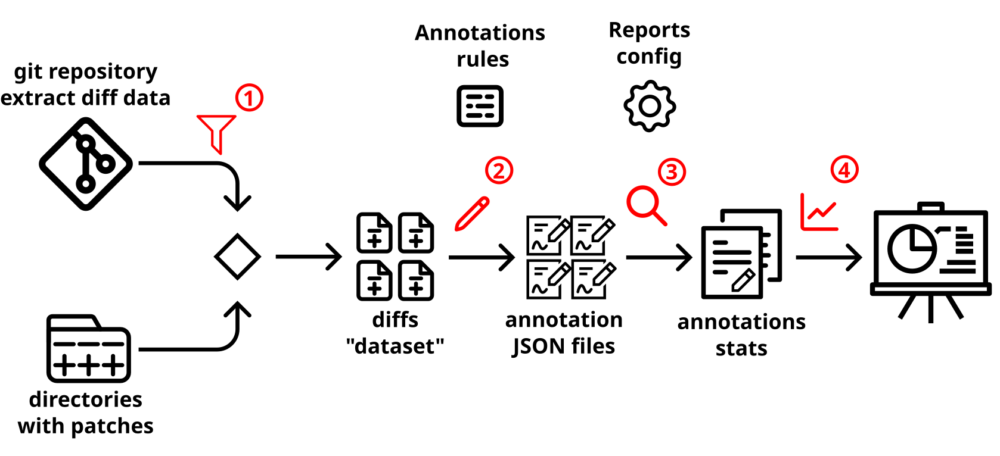

[](https://choosealicense.com/licenses/mit/)


[](https://editorconfig.org/)
[](https://github.com/tophat/getting-started/blob/master/scorecard.md)

# PatchScope – A Modular Tool for Annotating and Analyzing Contributions


PatchScope project consists of two parts: a set of command line tools, and a web app. 
Command line tools annotate changed files and lines of diffs (patches) with their purpose and type,
and perform statistical analysis on the generated annotation data.
The web application visualizes project development using analysis
generated and saved to JSON files by PatchScope's command line tools.

> _Note:_ this project was called 'python-diff-annotator' earlier in its history instead of 'PatchScope',
> and the python package was called 'diffannotator' instead of being called 'patchscope',
> so there are some references to that older name, for example in directory names
> in some Jupyter Notebooks.
 
You can find early draft of the project documentation at <https://ncusi.github.io/PatchScope/>.

Demo of the web application can be found at <https://patchscope.mat.umk.pl/>.

Check out our [video demonstration](https://youtu.be/8fj8Mgv-72s) on YouTube.

## Disambiguation

There are a few research projects with a similar name:

- Asma Ghandeharioun, Avi Caciularu, Adam Pearce, Lucas Dixon, Mor Geva:
  _"Patchscopes: A Unifying Framework for Inspecting Hidden Representations of Language Models"_ (2024)
  [arXiv:2401.06102](https://arxiv.org/abs/2401.06102)
- Lei Zhao, Yuncong Zhu, Jiang Ming, Yichen Zhang, Haotian Zhang, Heng Yin:
  _"PatchScope: Memory Object Centric Patch Diffing"_ (2020)
  [DOI:10.1145/3372297.3423342](https://doi.org/10.1145/3372297.3423342)


## Installation

Use the package manager [pip](https://pip.pypa.io/en/stable/) to install `patchscope`.

To avoid dependency conflicts, it is strongly recommended to create
a _[virtual environment][venv]_ first, activate it, and install `patchscope`
into this environment.
```commandline
python -m venv .venv
source .venv/bin/activate
```

To install the most recent version, use
```commandline
python -m pip install patchscope@git+https://github.com/ncusi/PatchScope#egg=main
```
or (assuming that you can clone the repository with SSH)
```commandline
python -m pip install patchscope@git+ssh://git@github.com/ncusi/PatchScope.git#egg=main
```

The command above does not install dependencies required to run the web app;
for this you need to install `[web]` optional dependency, for example with:
```commandline
python -m pip install 'patchscope[web] @ git+https://github.com/ncusi/PatchScope#egg=main'
```

If you want to reproduce examples available in this repository,
or those available from [DagsHub](https://dagshub.com/ncusi/PatchScope),
or if you want to modify PatchScope code to better suit your need,
you can instead clone PatchScope repository, and install it from there.
```commandline
git clone https://github.com/ncusi/PatchScope.git
cd PatchScope
python -m pip install --editable .[dev,web]
```
See also the ["Development"](#development) section below.


## Usage

[](./docs/assets/diagram/diagram.svg)

This tool integrates four key components

1. extracting patches from a version control system or user-provided folders<br>
   either as separate step with `diff-generate`,
   or integrated into the annotation step (`diff-annotate`)
2. applying specified annotation rules for selected patches<br>
   using `diff-annotate`, which generates one JSON data file per patch
3. generating configurable reports or summaries<br>
   with various subcommands of `diff-gather-stats`; each summary is saved as a single JSON file
4. advanced visualization with a web application (dashboard)<br>
   which you can run it with `panel serve`, see the description below

You can use PatchScope to
analyze individual patch files,
enhance patch-based datasets,
and monitor contributions to repositories.
The process for those use cases differs in details;
here is a quick start tutorial for the case of repository contribution analysis.

### Quick start: analyzing repository

The first step is to clone the repository you want to analyze,
if not already present.  Let's assume that you want to
get insights about [tqdm][] project development.
```commandline
git clone https://github.com/tqdm/tqdm.git repos/tqdm
```
The clone might be bare.

[tqdm]: https://tqdm.github.io/ "A Fast, Extensible Progress Bar for Python and CLI"

Second step is to generate annotations with `diff-annotate from-repo`.
This might take a while for a larger repository, like the Linux kernel.
You can use [Git revision selection](https://git-scm.com/docs/gitrevisions)
arguments to select changes to annotate; for example, you can use
`--max-parents=1` to drop merges,
and `--after=2020.01.01` to limit date range.
```commandline
diff-annotate from-repo \
   --output-dir=annotations/tqdm/since-2020 \
   repos/tqdm --max-parents=1 --after=2020.01.01
```

Third step is to generate summary of annotations with `diff-gather-stats`,
gathering statistics into a single JSON file.
For repository visualization, you will need at least the timeline.
```commandline
diff-gather-stats --annotations-dir='' \
   timeline \
   --purpose-to-annotation=data \
   --purpose-to-annotation=documentation \
   --purpose-to-annotation=markup \
   --purpose-to-annotation=other \
   --purpose-to-annotation=project \
   --purpose-to-annotation=test \
   stats/tqdm.timeline.purpose-to-type.json \
   annotations/tqdm/
```

If you want to see Sankey flow diagram in the visualization,
you need also to generate a summary of changed lines statistics.
```commandline
diff-gather-stats --annotations-dir='' \
   lines-stats \
   --purpose-to-annotation=data \
   --purpose-to-annotation=documentation \
   --purpose-to-annotation=markup \
   --purpose-to-annotation=other \
   --purpose-to-annotation=project \
   --purpose-to-annotation=test \
   stats/tqdm.lines-stats.purpose-to-type.json \
   annotations/tqdm/
```

> Note that the web application assumes that generated timeline
> and lines-stats files follow the `*.timeline.*.json` and
> `*.lines-stats.*.json` naming convention.

You can find more information about the annotation process in
_"[Annotation process](docs/annotation_process.md)"_ documentation.

### Running web app (dashboard)

This package also includes a web dashboard, created using the [Panel][]
framework.  You would need to install additional dependencies, denoted `[web]`,
as described above.

To run this web app, you can use the `diffinsights-web` command,
providing the directory with `*.timeline.*.json` files.
With the previous example, with `diff-gather-stats timeline` output
saved in `stats/` subdirectory, it would be:
```commandline
diffinsights-web stats/
```
Then open `http://localhost:7860/?repo=tqdm` in a web browser.

Currently, this web dashboard consists of two pages (two web apps),
namely the Contributors Graph and the Author Statistics.

You can find the description of those two pages/apps, with screenshots,
in [PatchScope documentation](https://ncusi.github.io/PatchScope/contributors_graph/):
- [`docs/author_statistics.md`](docs/author_statistics.md)
- [`docs/contributors_graph.md`](docs/contributors_graph.md)

### Web app demo with example projects

The PatchScope repository includes annotations and gathered statistics
for a few example repositories in [`data/examples/`](./data/examples)
directory.

You can download data for more repos from <https://dagshub.com/ncusi/PatchScope>
with [DVC][], see the ["Examples and demos"](#examples-and-demos) section below.

There is a web app demo available for those repos at <https://patchscope.mat.umk.pl/>,
and also basic [demo on Heroku](https://patchscope-9d05e7f15fec.herokuapp.com/).

The simplest solution to run those demos locally is to clone
the PatchScopes repository, and enter it:
```commandline
git clone https://github.com/ncusi/PatchScope.git
cd PatchScope
```
Then, assuming that required `[web]` dependencies are installed
(in a current virtual environment),
you can run web dashboard with `panel serve`:
```commandline
panel serve \
   src/diffinsights_web/apps/contributors.py \
   src/diffinsights_web/apps/author.py \
   --index=contributors \
   --reuse-sessions --global-loading-spinner
```

By default, it would make this web dashboard available at <http://localhost:5006/>.

There is also [`Dockerfile`](./Dockerfile) if you want to run web dashboard
using Docker (with example projects).

[Panel]: https://panel.holoviz.org/


## Examples and demos

The PatchScope repository also includes some examples demonstrating how this
project works, and what it can be used for.

### First time setup (for generating examples)

You can set up the environment for using this project, following
the recommended practices (described in the _"[Development](#development)"_
section of this document), by running the [`examples-init.bash`](examples-init.bash) Bash script,
and following its instructions.

Note that this script assumes that it is run on Linux, or Linux-like
system.  For other operating systems, you are probably better following
the steps described in this document manually.

This script includes the configuration section at the beginning of it;
you can change parameters to better fit your environment:

- `DVCSTORE_DIR` - directory with local dvc remote
- `PYTHON` - Python 3.x executable (before activating virtual environment)


This project uses [DVC](https://dvc.org/) (Data Version Control) tool
to track annotations and metrics data, and version this data.  It allows
storing large files and large directories outside of Git repository,
while still have them to be version controlled.  They can be stored locally,
or in the cloud.

The [`examples-init.bash`](examples-init.bash) script also configures
local DVC storage (see the next subsection).

### Data pipeline with DVC

To provide reproducibility, and to make it possible to version data files
separately from versioning the code, this project uses [DVC][] (Data Version Control)
tool for its examples.

_DVC pipelines_ are versioned using Git, and allow you to better organize projects
and reproduce complete workflows and results at will.  The pipeline is defined
in the [`dvc.yaml`](./dvc.yaml) file.

You can re-run the whole pipeline, after installing DVC, with the `dvc repro`
command.  It will run only those pipeline stages that needed it, by examining
if stage dependencies (defined in `dvc.yaml`) changed.  The results are saved
in _DVC cache_, and you can push them to _DVC remote_ with `dvc push`, if you have
one configured (the `examples-init.bash` script from previous subsection
configures DVC remote with storage on the local filesystem).

<!-- TODO: add a figure about how DVC works -->

### Downloading data from DAGsHub

[DAGsHub][] is a platform for AI and ML developers that lets you manage and collaborate
on your data, models, experiments, alongside your code.  Among other things, it can
be used as [DVC][] remote.

Here is fragment from `.dvc/config` that defines "dagshub" DVC remote to store data:

```ini
['remote "dagshub"']
    url = s3://dvc
    endpointurl = https://dagshub.com/ncusi/PatchScope.s3
```

Note that you need to install support for S3 for DVC to use this remote, see
[Example: installing DVC with support for Amazon S3 storage][dvc-s3-install].

You can then download all data with `dvc pull -r dagshub`.

Alternatively, you can download data via DagsHub web interface,
from <https://dagshub.com/ncusi/PatchScope>:

- [`data/examples/`](https://dagshub.com/ncusi/PatchScope/src/main/data/examples)
  includes annotations and statistics for a few example repositories:
    - [hellogitworld](https://github.com/githubtraining/hellogitworld) (only statistics, repository archived 2020),
    - [qtile](https://github.com/qtile/qtile),
    - [tensorflow](https://github.com/tensorflow/tensorflow) (limited to top-2 non-bot authors),
    - [linux](https://git.kernel.org/pub/scm/linux/kernel/git/torvalds/linux.git) (years 2021-2023)
- [`data/experiments/`](https://dagshub.com/ncusi/PatchScope/src/main/data/experiments)
  includes various pieces of data computed when comparing
  automatic annotations generated by PatchScope with manual annotations
  from BugsInPy subset of HaPy-Bugs dataset, and with manual annotations
  from Herbold et al. _"A fine-grained data set and analysis of tangling in bug fixing commits"_
  available in SmartSHARK.

[DVC]: https://dvc.org/ "Data Version Control · DVC"
[DAGsHub]: https://dagshub.com/ "DagsHub: A Single Source of Truth for your AI Projects"
[dvc-s3-install]: https://dvc.org/doc/install/linux#example-pip-with-support-for-amazon-s3-storage "pip install 'dvc[s3]'"

### Jupyter Notebooks

The `notebooks/` directory contains Jupyter Notebooks with data exploration,
data analysis, etc.  See [`notebooks/README.md`](./notebooks/README.md)
in [PatchScope repository](https://github.com/ncusi/PatchScope) for details.

## Development

### Virtual environment

To avoid dependency conflicts, it is strongly recommended to create
a [virtual environment][venv], for example with:
```commandline
python -m venv .venv
```

This needs to be done only once, from the top directory of the project.
For each session, you should activate the environment:
```commandline
source .venv/bin/activate
```

Using virtual environment, either directly like shown above, or
by using `pipx`, might be required if you cannot install system
packages, but Python is configured in a very specific way:

> error: externally-managed-environment
>
> × This environment is externally managed

[venv]: https://python.readthedocs.io/en/stable/library/venv.html

### Installing the package in editable mode

To install the project in editable mode (from the top directory of this repo):
```commandline
python -m pip install -e .
```

To be able to also run test, use:
```commandline
python -m pip install --editable .[dev]
```

### Running tests

This project uses [pytest](https://docs.pytest.org/) framework.
Note that `pytest` requires Python 3.8+ or PyPy3.

To run tests, run the following command
```commandline
pytest
```
or
```commandline
python -m pytest
```

### Roadmap

See [`TODO.md`](./TODO.md) in [PatchScope repository](https://github.com/ncusi/PatchScope).

## Publications

- Piotr Przymus, Jakub Narębski, Mikołaj Fejzer, and Krzysztof Stencel:
  _"PatchScope – A Modular Tool for Annotating and Analyzing Contributions"_ (2024),
  preprint: <https://ncusi.github.io/PatchScope/articles/patchscope_2024.pdf>

## Related projects

Here are some related projects that can also be used
to extract development statistics from project or a repository.

Command line and terminal interface tools:

- [`git-quick-stats`](https://git-quick-stats.sh/)
  
  is a simple and efficient way to access various statistics in a git repository
- [`git-stats`](https://github.com/IonicaBizau/git-stats)
  
  provides local git statistics, including GitHub-like contributions calendars
- [`git_dash.sh`](https://github.com/darul75/git_dash)
  
  is a command-line shell script
  for generating a Git metrics dashboard directly in your terminal
- [`heatwave`](https://github.com/james-stoup/heatwave)
  
  visualizes your git commits with a heat map in the terminal,
  similar to how GitHub's heat map looks
- [`statscat`](https://github.com/z1cheng/statscat)
  
  is a CLI tool to get statistics of your all git repositories
- [hxtools](https://inai.de/projects/hxtools/)
  
  by Jan Engelhardt
  is a collection of small tools and scripts, which include
  `git-author-stat` (commit author statistics of a git repository),
  `git-blame-stat` (per-line author statistics), and
  `git-revert-stats` (reverting statistics)
- [git-fame](https://github.com/casperdcl/git-fame) (in Python ) and
  [git-fame-rb](https://github.com/oleander/git-fame-rb) (in Ruby )
  are command-line tools to pretty-print Git repository collaborators
  sorted by contributions
- [`git-of-theseus`](https://github.com/erikbern/git-of-theseus)
  
  is a set of scripts to analyze how a Git repo grows over time.
    - See [The half-life of code & the ship of Theseus](https://erikbern.com/2016/12/05/the-half-life-of-code.html)
      by Erik Bernhardsson (2016).
- GitHub [Linguist](https://github.com/github-linguist/linguist)
  
  can also be used from the command line, using the `github-linguist` executable
  to generate repository's languages stats
  (the language breakdown by percentage and file size),
  also for selected revision
- [git-metrics](https://github.com/Praqma/git-metrics)
  
  tool is a set of util scripts to scrape data from git repositories
  to help teams improve (metrics such as lead time and open branches)

Tools to generate HTML dashboard, or providing an interactive web application:

- [GitStats](https://github.com/akashraj9828/gitstats)
  is an open source GitHub contribution analyzer, providing live dashboard;<br>
  **note** that [gitstats.me](https://gitstats.me/) no longer works
  (the domain is parked for sale)
- [`repostat`](https://github.com/vifactor/repostat)
  is Git repository analyzer and HTML-report generator
  with [NVD3](https://nvd3.org/)-driven interactive metrics visualisations;<br>
  **note** that demo site <https://repostat.imfast.io/> no longer works
    - [NVD3.js](https://nvd3.org/) is an attempt to build re-usable charts
      and chart components for [d3.js](https://d3js.org/)
- [Repositorch](https://github.com/kirnosenko/Repositorch)
  is a Git repository analysis engine written in C#;
  it recommends using Docker Compose to install
  ([Repositorch on Docker Hub](https://hub.docker.com/r/kirnosenko/repositorch))<br>
  no demo site, but there is "[How to use Repositorch](https://www.youtube.com/watch?v=Rd5R0BbFdGA)"
  video on YouTube
- [cregit](https://github.com/cregit/cregit)
  is a tool for helping to find and analyse code credits
  (unify identities, find contribution by token,
  extract metadata into an SQLite database, etc.)
- [Githru](https://github.com/githru/githru) is an interactive visual analytics system
  that enables developers to effectively understand the context of development history
  through the [interactive exploration of Git and GitHub metadata (demo)](https://githru.github.io/demo/).
  It uses [novel techniques (paper)](https://arxiv.org/abs/2009.03115) (graph reconstruction,
  clustering, and Context-Preserving Squash Merge (CSM) methods) to abstract
  a large-scale Git commit graph.
- [Assayo](https://github.com/bakhirev/assayo) is a dashboard
  providing visualization and analysis of git commit statistics.
  Requires exporting data from Git.  Has a [homepage with demo](https://assayo.online/).
  Its use is described in _[The visualization and analysis of git commit statistics for IT team leaders](https://dev.to/responsivecrocodile/the-visualization-and-analysis-of-git-commit-statistics-for-it-team-leaders-2pof)_.

Visualizations for a specific repository:

- [A Git history visualization page](https://git-history.jpalmer.dev/)
  by Jeff Palmer shows _"An Interactive Development History"_ of Git:
  project and contributor statistics, relative cumulative contributions
  by contributor, and aggregated commits by contributor by month
  with milestone annotations.
  Jeff wrote [an associated blog post](https://jpalmer.dev/2021/05/interactive-git-history/)
  about how he created the visualization.
- [`gitdm`](https://github.com/npalix/gitdm) (the "git data miner")
  is the tool that Greg KH and Jonathan Corbet have used
  to create statistics on where kernel patches come from.
  Written in Python.  Original at `git://git.lwn.net/gitdm.git`

Web applications that demonstrate some MSR tool:

- GitHub offers GitHub Insights for repositories
  (see for example [Contributors to qtile/qtile](https://github.com/qtile/qtile/graphs/contributors)).
  This includes the following subpages:
    - _**Pulse**_ (with configurable period of 1 month, 1 week, 3 days, 24 hours)
      shows information about pull requests and issues, and summary of changes as text
      (_N_ authors pushed _X_ commits to master, and _Y_ to all branches.
      On master, _M_ files were changed ad there had been _A_ additions and _D_ deletions).
    - _**Contributions**_ per week to master, excluding merge commits
      {as smoothed (!) line/area plot}, for whole project,
      and for up to 100 authors (with configurable period of all, last month, last 3 months,
      last 6 months, last 12 months, last 24 months; with configurable type of contributions:
      commits, additions, deletions).  For each author we also have summary of their
      contributions as text (_N_ commits, _A_ ++, _D_ --).
    - _**Commits**_ shows two plots: bar plot of commits per week over time
      for the last year {without any explanation, except for information shown on mouse hover},
      and line plot with days of the week on x-axis {no explanation, no information on hover (!)}.
      No configuration.
    - _**Code frequency**_ over the history of the project: additions and deletions per week
      (where additions use green solid lines, and deletions use red dashed lines and are plotted
      upside-down).  No configuration.
    - other pages related to GitHub specifically, or the project as whole but not its history
      (like _Community Standards_, _Dependency graph_, _Forks_, or _Action Usage Metrics_).
- GitHub also offers Developer Overview, which among others include the following chart:
    - _N_ contributions in last year / in YYYY, showing _**heatmap**_ using 5-color discrete colormap,
      with year worth of weeks on x-axis, and day of the week (Sun to Sat) on the y-axis.
      You can switch between the years with a "radio button" (though there is no 'last year' entry).
      Contributions are timestamped according to Coordinated Universal Time (UTC)
      rather than contributor's local time zone.
- [Assayo](https://github.com/bakhirev/assayo) has a
  [homepage with demo](https://assayo.online/) where you can
  provide the output of given Git CLI command in your repo
  to create the demo for your repo,
  and there is also view a demo with mock data.
  Written in JavaScript with React.
- [Githru](https://github.com/githru/githru) has an
  [interactive demo](https://githru.github.io/demo/),
  where you can select one of the following two GitHub repositories
  to visualize: `vuejs/vue` and `realm/realm-java`.
  Written in JavaScript with React, D3, dagre.
- [GitVision](https://github.com/gaspardIV/gitvision), a 3D repository
  graph visualization tool, has a [live demo](https://gitvis.web.app/)
  with visualization for more than 20 repositories (ranging from tiny
  to large), and where you can visualize your own repository by
  uploading the result of running the [GitVision script](https://github.com/GaspardIV/gitvision/tree/main/tool).
  The demo [is written](https://github.com/GaspardIV/gitvision/tree/main/gitvisionwebapp)
  in JavaScript using Vue and deployed with Vite.
- [GitBug-Java](https://github.com/gitbugactions/gitbug-java),
  a reproducible Java benchmark of recent bugs (tool accompanying
  the _[GitBug-Java: A Reproducible Java Benchmark of Recent Bugs](https://doi.org/10.1145/3643991.3644884)_
  paper ([on arXiv](https://arxiv.org/abs/2402.02961))),
  has [web app visualizing the dataset](https://nfsaavedra.github.io/gitbug-java).
  No source code for the web app; it seems to be in JavaScript
  using Angular, with the help of Chart.js and diff2html.
- [Defects4J Dissection](https://program-repair.org/defects4j-dissection/#!/)
  is an open-source web app that presents data to help researchers and practitioners
  to better understand the [Defects4J bug dataset](https://github.com/rjust/defects4j).
  Includes table view (the default) and [charts](https://program-repair.org/defects4j-dissection/charts.html).
  It is the open-science appendix of
  _"[Dissection of a bug dataset: anatomy of 395 patches from Defects4J](https://arxiv.org/abs/1801.06393)"_ paper.
  [Written in Python and JavaScript](https://github.com/program-repair/defects4j-dissection/),
  under MIT license.


## Contributing

Pull requests are welcome. For major changes, please open an issue first
to discuss what you would like to change.

Please make sure to update tests as appropriate.

## License

[MIT](https://choosealicense.com/licenses/mit/)
