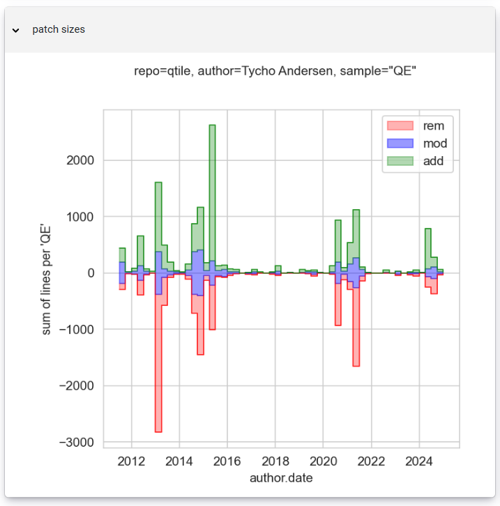

# Author Statistics

This dashboard shows various different plots
for selected author in selected repository in selected JSON data file.

It is somewhat similar to 
per-author part of the Contributors Graph part of GitHub Insights tab for a repository, 
or plots in the Overview tab for a given author / contributor on GitHub.

This dashboard app was created using HoloViz [Panel][] version 1.5.4.

## Running the app

You can run this app with `panel serve src/diffinsights_web/apps/author.py`
from the top directory of PatchScope sources.  You can get source code
from GitHub: <https://github.com/ncusi/PatchScope>.

The demo of this app is also available at
<https://patchscope-9d05e7f15fec.herokuapp.com/author>.

## Available plots

This app includes, as of PatchScope version **0.4.1**, the following plots:

- selected aggregation function (e.g. sum) over selected time period (e.g. weekly)
  of added ('+:count') and deleted ('-:count') lines in a commit, shown on one plot
- as above, but for selected line type (e.g. 'type.code'),
  or its overall contribution as ratio / percentage (e.g. 'type.code \[%]')
- contributions to patch size, namely added lines ('add'), deleted lines ('rem'),
  and how much of those were neighbouring changes and count as modified lines ('mod'),
  all on the same plot
- commit count over selected time period (e.g. week, making it weekly commit count)
- (bi)histogram of added ('+:count') and removed ('-:count') lines per commit
- (bi)histogram of added ('+:count') and removed ('-:count') lines per resample period
  (e.g. weekly)
- heatmap of types of contributions (line types) over date,
  separately for deleted lines (using Reds colormap)
  and added lines (using Greens colormap),
  as of **0.4.1** with fixed monthly frequency ('ME', <b>m</b>onth <b>e</b>nd)
- heatmap showing 2d distribution of total number of commits
  with marginal histograms, showing periodicity of contributions
  (uses author local time, assuming information about timezone was correct)

As of version **0.4.1** almost all plots are created using [Seaborn][] and/or
[Matplotlib][] libraries, and displayed using [Panel][]'s
[Matplotlib pane](https://panel.holoviz.org/reference/panes/Matplotlib.html),
with PNG or SVG rendering.
There are exceptions that use [hvPlot][] library (with some [HoloViews][] use),
with the [Bokeh][] backend.

Additionally, at the bottom of the main part of the page, after a horizontal
dividing line (a horizontal separator), there are a few informative panes,
as of **0.4.1** not yet grouped into single tabbed widget like in
[Contributors Graph app](contributors_graph.md):

- [Debugger widget](https://panel.holoviz.org/reference/widgets/Debugger.html)
  that shows show logs and errors from the running app
- [JSONEditor widget](https://panel.holoviz.org/reference/widgets/JSONEditor.html)
  in a 'view' mode, that shows the original JSON input data; you can search it
- [Tabulator widget](https://panel.holoviz.org/reference/widgets/Tabulator.html)
  that shows DataFrame with all the data extracted from JSON input file,
  and with the derived data; allows to sort and search each column
- [Perspective pane](https://panel.holoviz.org/reference/panes/Perspective.html)
  with data grouped / resampled over specified time period (e.g. 'W' for weekly)
  and aggregated with specified aggregation function (e.g. sum)

[Bokeh]: https://bokeh.org/
[HoloViews]: https://holoviews.org/
[hvPlot]: https://hvplot.holoviz.org/
[Matplotlib]: https://matplotlib.org/
[Panel]: https://panel.holoviz.org/
[Seaborn]: https://seaborn.pydata.org/

### Code frequency over time, for author

This plot shows, by default, the total number of added and deleted lines
over given period of time (weekly, semi-monthly, monthly, quarterly, etc.),
that is the sum of number of added and deleted lines in a commit over all commits
that were authored by given author in a given period of time.

Added lines are shown with <i>y</i>-axis pointing up, using green line color, while
deleted lines are shown with <i>y</i>-axis pointing down, using red line color.

Here is an example for qtile repository (from PatchScope version **0.4.1**):


It is step area plot; step function was selected to denote that it is aggregate
over given period of time - in the example above, over quarter (QE - quarter end).

Here is the same plot, but with smaller resample period, monthly (ME - month end):


And here is with even smaller resample period, weekly (W - week):


This plot is very similar to the Code Frequency plot in GitHub Insights pane
for a repository, but the GitHub Code Frequency plot is for the whole repository,
not for selected author, and the resample frequency is fixed: weekly.

Here is an example for qtile repo from
<https://github.com/qtile/qtile/graphs/code-frequency>:


This plot uses solid green line for additions, and dashed red line for deletions.
It literally uses negative values for deletions, instead of inverting
the y-axis.  It is an interactive plot - you can get exact values on hover.

### Line type frequency over time, for author

The next plot is the 'line type / file purpose counts' plot
(though as of version **0.4.1**, only line type are turned on and available).
This uses the same type of plot as the previous one,
that its it shows contributions from added and deleted lines on the same plot,
with contribution from deleted lines shown on reversed y-axis.

The difference is where the data to plot comes from.  Instead of considering
each changed line, as in the case of the previous plot, you can select
what kind of lines you want to count.  The line types present in the
input data depend on the configuration of the annotation process (`diff-annotate`),
and  optionally on the configuration of the post-processing step (`diff-gather-stats`).

What counts as line of specific type also depends on the configuration of the
annotation process.  For `*.timeline.purpose-to-type.json` data files, the following
rules were applied (see also similar description in [Contributors Graph](contributors_graph.md)
documentation):

- if the changed file purpose (the changed line belong to) was either
  of "data", "documentation", "markup", "other", "project", or "test",
  then the line counts as that type,
- if line consists only of whitespace and comments, or is inside docstring,
  it counts as "documentation",
- otherwise it counts as "code".

This is not the only possible configuration.  For example, you might want
comments in "test" files to count as "documentation", and only lines with
some code count as "test".  This can be done with a line callback.

The following "columns" (line types) are available for the example data
files, as of PatchScope **0.4.1**:

- type.code
- type.documentation
- type.test
- type.data
- type.markup
- type.project
- type.other

GitHub Linguist uses the following categorization for _language_ types
(those are for the file as a whole; depending on configuration of the
annotation process, every changed line can be labelled as having that
type):

- data (for example: `*.afm`, `CODEOWNERS`, `*.csv`, `*.json`, `*.diff`,
  but it also includes some project files, like Pip Requirements: `requirements.txt`;
  "project" files are specified in PatchScope with custom rules), 
- programming (for example: `*.asm`, `*.c`, `*.cpp`, `*.py`,
  but it includes also some project files, like `CMakeLists.txt` and `Makefile`),
- markup (for example: `*.css`, `*.html`, `*.jinja`, `*.ipynb`, `*.tex`), 
- prose (for example: `*.po` (gettext), `*.md` (Markdown), `*.txt` (plain text)), 
- nil

Here is an example of the plot for 'type.data' changed lines (added and deleted
lines, plotted separately but on the same plot), the quarterly ('QE') count
('sum' as aggregation function), for selected author in selected repository:


This plot is from PatchScope version **0.4.1**.

For each line type (like 'type.code', for example) there is also corresponding
line type percentage equivalent (like 'type.code \[%]', for example).
This percentage is computed as the number of added ('+') or deleted ('-')
lines of given type (kind), over total number of added or deleted lines.

Here is an example of the plot for 'type.code \[%]' (from version **0.4.1**
of PatchScope):


The figure above shows that for this author, in this specific repository,
changes to code dominate.  Note that cases where both percentages are zero
('+:type.code' and '-:type.code') means that for given period of time there
were no commits contributed by the selected author.

### Patch size components over time, for author

The definition of patch size (and its components) was taken from
the Defects4J-Dissection paper[^defects4j-dissection].

[^defects4j-dissection]: Victor Sobreira, Thomas Durieux, Fernanda Madeiral, Martin Monperrus, and Marcelo de Almeida Maia _"Dissection of a Bug Dataset: Anatomy of 395 Patches from Defects4J"_, SANER 2018, https://doi.org/10.1109/SANER.2018.8330203

The patch size metric is sum of the number of added, modified, and removed (deleted) lines.
Lines are considered _modified_ when sequences of removed lines are straight followed by added lines ~~(or vice versa).~~
To count each modified line, a pair of adjacent added and removed lines is needed.

Take for example the following diff, which is a part of commit
[46bf2086](https://github.com/qtile/qtile/commit/46bf2086273d52049d9b8c6ee528a3d5aeb16ee2)
in qtile repository (first hunk of changes):

```diff
diff --git a/test/test_hook.py b/test/test_hook.py
index effd70a9..e005ac68 100644
--- a/test/test_hook.py
+++ b/test/test_hook.py
@@ -27,14 +27,12 @@ import pytest

 import libqtile.log_utils
 import libqtile.utils
-from libqtile import hook
+from libqtile import config, hook, layout
+from libqtile.config import Match
 from libqtile.resources import default_config
-from test.conftest import BareConfig
+from test.conftest import BareConfig, dualmonitor
 from test.helpers import Retry

-# TODO: more tests required.
-# 1. Check all hooks that can be fired
-

 class Call:
     def __init__(self, val):
```

This diff consists of 3 sequences of changed lines (change groups,
or "chunks" using the term from Defects4j-Dissection paper[^defects4j-dissection]).
In 1st group there is 1 modified line and 1 added line,
in 2nd group there is 1 modified line, and
in 3rd group there are 3 deleted (removed) lines.
In total, for this hunk of changes in `test/test_hook.py` file,
the algorithm finds 3 removed lines, 2 modified lines, and 1 added line.

The 'patch sizes' plot (shown below) counts things a bit differently:
it counts modified lines and added lines up, adding to all '+' lines, and
it counts modified lines and removed lines down, adding to all '-' lines.



This means that modified lines are kind of counted twice,
once pointing up (adding to added lines, to sum to '+' lines),
once pointing down (adding to removed lines, to sum to '-' lines).
On one hand, it means that the height of the plot is not equal to
the patch size; on the other hand it means that the plot looks
very similar to the code frequency over time or 'line counts' plot:


Both plots were created using PatchScope version **0.4.1**.

Note that it is not always that first deleted line corresponds to first added line,
creating modified line.  In the following diff (taken from commit
[1db6bab2](https://github.com/qtile/qtile/commit/1db6bab250eda20159b425de4378d27241b2997e)
in qtile repository):
```diff
diff --git a/libqtile/widget/notify.py b/libqtile/widget/notify.py
index a87281e5..8a1eec1f 100644
--- a/libqtile/widget/notify.py
+++ b/libqtile/widget/notify.py
@@ -219,5 +219,6 @@ class Notify(base._TextBox):
             self._invoke()

     def finalize(self):
-        notifier.unregister(self.update, on_close=self.on_close)
+        if notifier is not None:
+            notifier.unregister(self.update, on_close=self.on_close)
         base._TextBox.finalize(self)

```
it is the second added line that was modified (if we consider whitespace
changes to be a modification).

See also similar description in the [Contributors Graph](contributors_graph.md)
documentation.

This algorithm does not always give the correct results.  Take for example
the [928a0447 commit](https://github.com/qtile/qtile/commit/928a0447f52a24f0c39cc135cb958a551c3855bb)
from the qtile repository:

```diff
diff --git a/docs/manual/releasing.rst b/docs/manual/releasing.rst
index ff7b31eb..0b935ee0 100644
--- a/docs/manual/releasing.rst
+++ b/docs/manual/releasing.rst
@@ -39,9 +39,10 @@ Be sure that you GPG-sign (i.e. the ``-S`` argument to ``git commit``) this comm
 6. Make sure all of these actions complete as green. The release should show up
    in a few minutes after completion here: https://pypi.org/project/qtile/

-7. send a mail to qtile-dev@googlegroups.com; I sometimes just use
-   git-send-email with the release commit, but a manual copy/paste of the
-   release notes into an e-mail is fine as well. Additionally, drop a message
-   in IRC/Discord.
+7. Push your tag commit to master.
+
+8. Update `the release string
+   <https://github.com/qtile/qtile.org/blob/master/config.toml#L49>`_ on
+   qtile.org.

 8. Relax and enjoy a $beverage. Thanks for releasing!

```

The current version of the algorithm (as of PatchScope **0.4.1**),
when run on the git diff, says  that there are 4 modified lines, and 1 added line,
while in reality  this part was completely rewritten,
and the correct answer should be 4 deletions (removals) and 1 addition.
