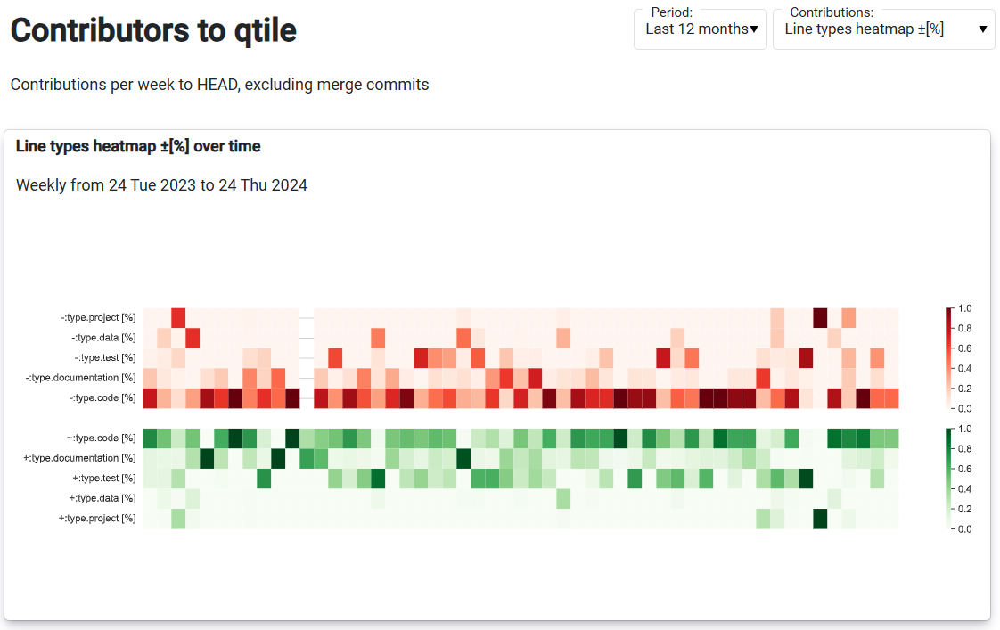
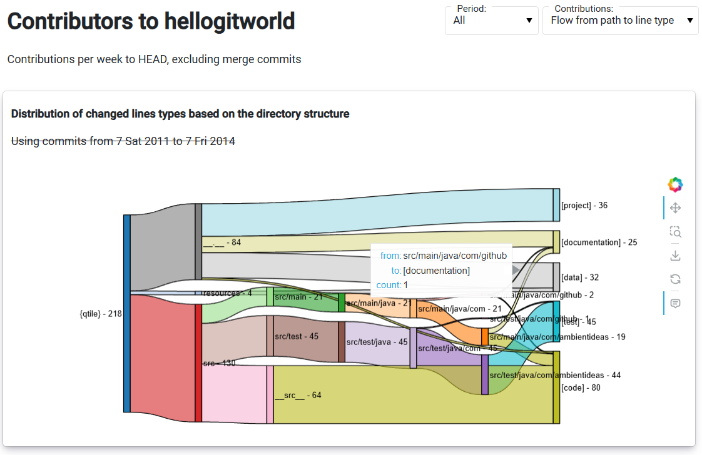
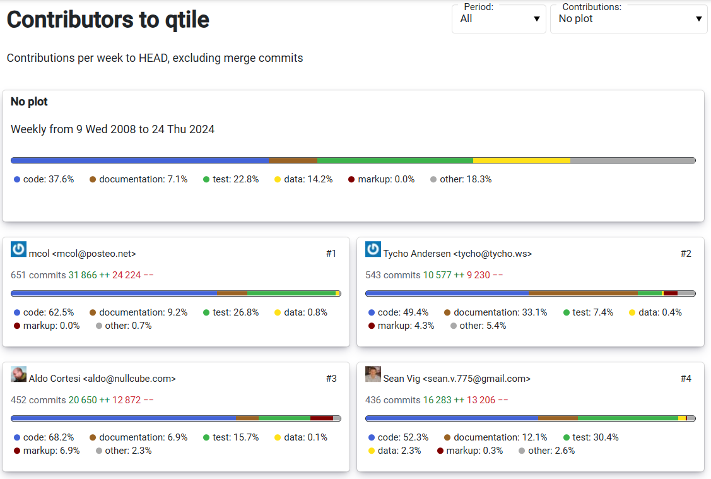
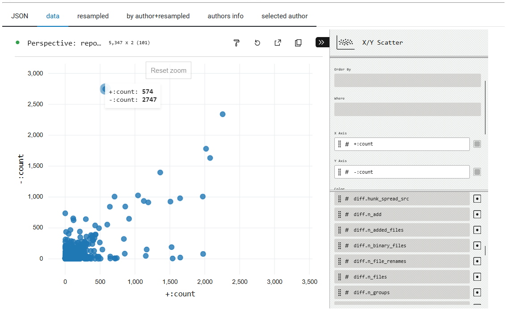
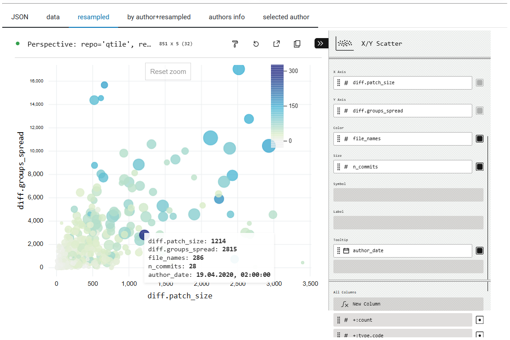
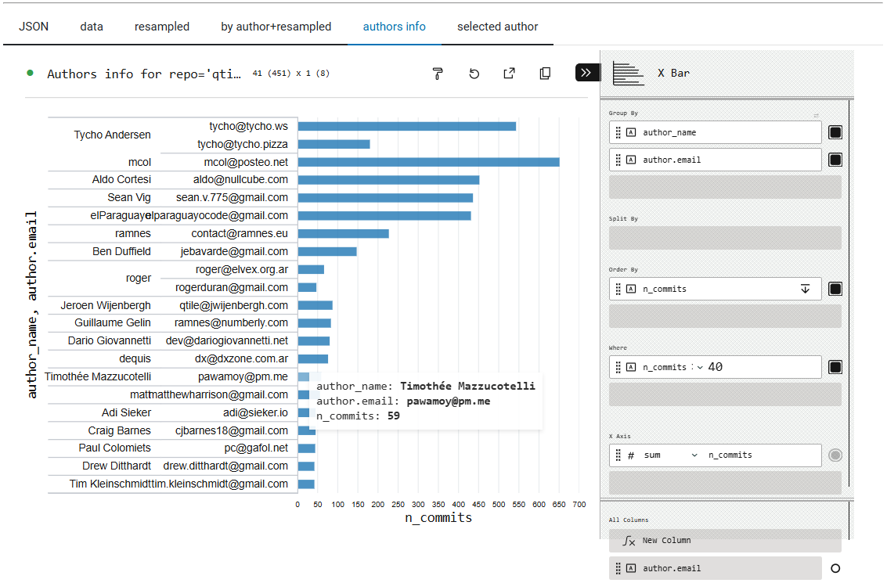

# Contributors Graph

This dashboard is meant to be
enhanced version of the Contributors subpage
in the Insights tab
for the GitHub repository
(example: <https://github.com/qtile/qtile/graphs/contributors>).

All examples are taken from **0.4.1** version of PatchScope.

## Running the app

You can run this app with `panel serve src/diffinsights_web/apps/contributors.py`
from the top directory of PatchScope sources.

The demo of this app is also available at
<https://patchscope-9d05e7f15fec.herokuapp.com/contributors>.


## Available plots

Contributors Graph dashboard provides plots (like weekly number of commits)
for the whole selected repository,
and individually for each of the top-N most active authors.

The GitHub Repo Insights offers the following plots<br>
<https://github.com/qtile/qtile/graphs/contributors>:

- Commits (commits over time)
- Additions (additions over time)
- Deletions (deletions over time)

The Contributors Graph in PatchScope's DiffInsights Web app
offers the following plots:

- Commits
- Additions
- Deletions
- Files changed
- Patch size (lines)
- Patch spreading (lines)
- Line types distribution \[%]<br>
  (area plot)
- Line types heatmap ±\[%]
- Flow from path to line type<br>
  (Sankey diagram, not over time)
- No plot

### Commits over time

This plot shows number of commits per given period of time.
For GitHub Insights, it is weekly number of commits,
that is total number of commits in a given week.
For PatchScope, it is configurable (via sidebar widgets).

The GitHub Insights version looks like the following:


The PatchScope Contributors Graph version looks like this<br>
taken from **0.4.1** version of PatchScope,
modified to remove line types percentage info:


Both plots are created for the same repository;
plots created by GitHub are "live",
plots created by PatchScope are based on annotations taken at some fixed point of time.
That is one of the reasons why numbers of commits per author doesn't match
between those two apps (services).

### Additions and deletions over time

This plot shows total number of added or deleted lines over given period of time,
that is the sum of number of added/deleted lines in a commit over all commits
that were authored in a given period of time (by default: over week).

This information is extracted from unified diff of changes in the commit (patch).
Note that changing a line in this method of counting shows as deleting
the old version, and adding a new version of a line.

For example, in the following [diff from the `tqdm` repository][335308-diff]
```diff
diff --git a/README.rst b/README.rst
index 7823c4b..9323c52 100644
--- a/README.rst
+++ b/README.rst
@@ -3,8 +3,8 @@ Unidiff

 Simple Python library to parse and interact with unified diff data.

-.. image:: https://travis-ci.org/matiasb/python-unidiff.svg?branch=master
-    :target: https://travis-ci.org/matiasb/python-unidiff
+.. image:: https://www.travis-ci.com/matiasb/python-unidiff.svg?branch=master
+    :target: https://travis-ci.com/matiasb/python-unidiff

 Installing unidiff
 ------------------
```
there are 2 deleted lines and 2 added lines in a single commit (patch).

[335308-diff]: https://github.com/matiasb/python-unidiff/commit/3353080f357a36c53d21c2464ece041b100075a1#diff-7b3ed02bc73dc06b7db906cf97aa91dec2b2eb21f2d92bc5caa761df5bbc168f

The GitHub Insights version of this plot looks like the following
(for the additions):


Note that the grid of per-author plots is now sorted by the number of added lines
(the "++" line), though in this case it is the same order as sorted by the number
of commits.

GitHub Insights draws all plots using the same line color.

The PatchScope Contributors Graph version of the added lines plot looks like this<br>
taken from **0.4.1** version of PatchScope,
modified to remove line types percentage info:


PatchScope's DiffInsights Web app draws
deletions using the red line color, and additions using the green line color,
just like the color when syntax-highlighting diffs (in most cases).

### Files changed over time

This plot shows the sum over given period of time (over week by default)
of number of files changed by the commit (or a patch).  The previous example
diff involved only a single file.

Note: This is not a number of unique files that were changed within given period
(for example within given week).

Here is how it looks in PatchScope (version **0.4.1**):


Note that it counts different _file name_ in a commit (or a patch),
excluding special case of `/dev/null`.  This means that file rename
counts as changing two files for the purposes of this plot.

### Patch size and patch spreading (lines) over time

The definition of patch size and of patch spreading was taken from
the Defects4J-Dissection paper[^defects4j-dissection].

#### Patch size metric

The **_patch size_** metric is sum of the number of added, modified, and removed lines.
Lines are considered _modified_ when sequences of removed lines are straight followed by added lines ~~(or vice versa).~~
To count each modified line, a pair of adjacent added and removed lines is needed.
The Defects4J-Dissection paper[^defects4j-dissection] shows on Listing 1 (shown below)
an example of patch with one modified line (line 635),
two non-paired removed lines (the old 636 and 639 lines),
and none non-paired added line, getting patch size of 3 lines.


You can also view the diff shown on the figure above at [Dissection of Closure 40][Closure-40-repair]
entry in the [Defects4J Dissection](https://program-repair.org/defects4j-dissection/#!/) web app
(on [program-repair.org](https://program-repair.org/)) accompanying the [defects4j-repair][] repository
that contains the raw experimental results of the experiments,
discussed in Defect4J-Repair paper[^defects4j-repair],
and referenced in Defects4J-Dissection paper[^defects4j-dissection].

Note that this diff is "Human Patch", and not [`git diff` patch text][git-diff-patch],
or [unified diff][detailed-unified], or even [context diff][detailed-context] format.

You can find the git commit corresponding to the Closure-40 patch inside
[Closure/commits-db][Closure-commit-db] CSV file in the [defects4j][] repository.
Note that [Closure/patches/40.src.patch][Closure-40-defects4j] in the same repository
is, for some reason, reverse of the "Human Patch" mentioned above.

The closest to the "Human Patch" is the diff for the [6ebc0c3d7d][6ebc0c3d7d4da7d2cf95f53d4ea790e89d3abc7a]
commit in [google/closure-compiler](https://github.com/google/closure-compiler)
(now on GitHub, originally on Google Code Project Hosting), with `--ignore-all-space`/`-w`
option, limited to project files (that is, excluding changes to tests):
```diff
diff --git a/src/com/google/javascript/jscomp/NameAnalyzer.java b/src/com/google/javascript/jscomp/NameAnalyzer.java
index 351210dd4..6e9e47036 100644
--- a/src/com/google/javascript/jscomp/NameAnalyzer.java
+++ b/src/com/google/javascript/jscomp/NameAnalyzer.java
@@ -632,14 +632,12 @@ final class NameAnalyzer implements CompilerPass {
         Node nameNode = n.getFirstChild();
         NameInformation ns = createNameInformation(t, nameNode, n);
         if (ns != null && ns.onlyAffectsClassDef) {
-          JsName name = getName(ns.name, false);
-          if (name != null) {
+          JsName name = getName(ns.name, true);
           refNodes.add(new ClassDefiningFunctionNode(
               name, n, parent, parent.getParent()));
         }
       }
     }
-    }

     /**
      * Records the assignment of a value to a global name.
```
For this diff/patch you get the same patch size of 3 lines: 1 modified, 2 removed
(this patch would count as having 3 deletions, and 1 addition).

[git-diff-patch]: https://git-scm.com/docs/git-diff#generate_patch_text_with_p "git-diff Documentation :: Generating patch text with -p"
[detailed-unified]: https://www.gnu.org/software/diffutils/manual/html_node/Detailed-Unified.html "GNU Diffutils :: Detailed Description of Unified Format"
[detailed-context]: https://www.gnu.org/software/diffutils/manual/html_node/Detailed-Context.html "GNU Diffutils :: Detailed Description of Context Format"
[6ebc0c3d7d4da7d2cf95f53d4ea790e89d3abc7a]: https://github.com/google/closure-compiler/commit/6ebc0c3d7d4da7d2cf95f53d4ea790e89d3abc7a?w=1&diff=split#diff-39a510ebc48ca3e1ac8049858cd1cf91e218503b73191ba406099b8ba63a1934

[^defects4j-repair]: Matias Martinez, Thomas Durieux, Romain Sommerard, Jifeng Xuan, and Martin Monperrus _"Automatic Repair of Real Bugs in Java: A Large-Scale Experiment on the Defects4J Dataset"_, ESE (2016), https://hal.archives-ouvertes.fr/hal-01387556/document

[^defects4j-dissection]: Victor Sobreira, Thomas Durieux, Fernanda Madeiral, Martin Monperrus, and Marcelo de Almeida Maia _"Dissection of a Bug Dataset: Anatomy of 395 Patches from Defects4J"_, SANER 2018, https://doi.org/10.1109/SANER.2018.8330203

[defects4j]: https://github.com/rjust/defects4j
[defects4j-repair]: https://github.com/Spirals-Team/defects4j-repair
[Closure-40-defects4j]: https://github.com/rjust/defects4j/blob/master/framework/projects/Closure/patches/40.src.patch
[Closure-commit-db]: https://github.com/rjust/defects4j/blob/master/framework/projects/Closure/commit-db
[Closure-40-repair]: https://program-repair.org/defects4j-dissection/#!/bug/Closure/40


See also similar discussion in [Author Statistics](author_statistics.md)
documentation.

Here is how it looks in PatchScope (version **0.4.1**):


#### Patch spreading metric

The **_patch spreading (lines)_** metric shown in the PatchScope web app
is the second patch spreading metric from Defects4J-Dissection paper[^defects4j-dissection],
namely _spreading of chunks_ in a patch.

A _chunk_ is defined in Defects4J-Dissection[^defects4j-dissection] as
a sequence of continuous changes in a file, consisting of the combination of
addition, removal, and modification of lines.  We will call it a _change group_
to avoid confusion with _hunk_ as defined by (unified) diff format.

The measure _spreading of chunk_ / _chunks spreading_ , we consider the number of lines
interleaving chunks (change groups).  In a patch with only one chunk, this value
is naturally zero, because such patch represents a continuous sequence of changes.
In a patch with two chunks, at least one line separates the chunks.
For patches involving more than one file, we sum the spreading of chunks of all files
to get the final spreading of the patch.

For the Closure-40 patch on Listing 1 figure above,
between the old line 636 (end of the first chunk)
and the old line 639 (beginning of the second chunk)
there is only 2 lines, which is the value of the
_spreading of chunks_ metric in this case.

Here is how it looks in PatchScope (version **0.4.1**):


Note that empty and comment lines were discarded for _chunk spreading_ calculations
in Defects4J-Dissection paper[^defects4j-dissection], but this was **not** done
by the PatchScope pipeline (patch annotation) and visualization.

### Line types distribution \[%] (area plot)

**TODO**

### Line types heatmap ±\[%]

All line types distribution plots show how many changed lines are of given type.
What counts as line of specific type depends on the configuration of the
annotation process.  For `*.timeline.purpose-to-type.json` data files, the following
rules were applied:

- if the changed file purpose (the changed line belong to) was either
  of "data", "documentation", "markup", "other", "project", or "test",
  then the line counts as that type,
- if line consists only of whitespace and comments, or is inside docstring,
  it counts as "documentation",
- otherwise it counts as "code".

This is not the only possible configuration.  For example, you might want
comments in "test" files to count as "documentation", and only lines with
some code count as "test".  This can be done with line callback.

See also similar discussion in [Author Statistics](author_statistics.md)
documentation.

For the ± percentage (\[%]) line types distribution plots, like this heatmap
plot, the percentage is computed as the number of added ('+') or deleted ('-')
lines of given type (kind), over total number of added or deleted lines.



Note that the color scale is linear, and that values in **0.4.1** of the ratio
were not rescaled from 0..1 range to 0%..100% range.

It is also, as of **0.4.1**, non-interactive (the app uses [Seaborn][sns.heatmap]
and [Matplotlib][], rather than [hvPlot][hvPlot-heatmap] to generate this plot).

[Matplotlib]: https://matplotlib.org/
[sns.heatmap]: https://seaborn.pydata.org/generated/seaborn.heatmap.html
[hvPlot-heatmap]: https://hvplot.holoviz.org/user_guide/Plotting.html#heatmap

### Flow from path to line type (Sankey diagram)

**Sankey diagrams** are a data visualisation technique or flow diagram
that emphasizes flow/movement/change from one state to another (or one time to another),
in which the width of the arrows is proportional to the flow rate
of the depicted extensive property.

In the case of PatchScope's DiffInsights Web app, the property described
is the number of changed lines (sum of added and deleted lines), and
the state is either a subdirectory in the project (from the left side, following
the directory hierarchy), or a line type (on the far right side).

The [Sankey Diagram](https://www.data-to-viz.com/graph/sankey.html) is in this
case used for showing _source to end_ flow.

There are a few examples of [Python implementations of Sankey diagram](https://python-graph-gallery.com/sankey-diagram/)
shown on [The Python Graph Gallery](https://python-graph-gallery.com/) site,
including with Plotly and with pySankey.  Currently, PatchScope **0.4.1**
uses [HoloViews Sankey Element with Bokeh backend](https://holoviews.org/reference/elements/bokeh/Sankey.html),
but use of [Plotly](https://plotly.com/python/sankey-diagram/) is planned
(and possibly [Mermaid.js](https://mermaid.js.org/syntax/sankey.html)).

Here is how it looks in PatchScope (version **0.4.1**):



For example, on the diagram above, you can see that there was one changed
line in some file in `src/main/java/com/github/` subdirectory which counted
as "documentation" (it must have been line that consisted only of comments).

Note that to plot Sankey diagram one needs more information that is present
in the `*.timeline.*.json` data file, because "timeline" data file contains
only summary information about commits/bug-fixes/patches, and not individual
changed files.

Therefore, to be able to draw Sankey diagram, there needs to be corresponding
`*.lines-stats.*.json` file present.  As of **0.4.1**, PatchScope does not _yet_
use the timeline data to limit Sankey to subset of commits: either limiting
to given time period, or limiting to commits authored by given author.

### No plot

This option is here to be able to easier compare non-plot information among
top-N authors in the authors grid.

With this option it is easy to compare the totals (number of commits, number
of additions ('++'), number of deletions ('--')), and distribution of changed
lines (as percentage '\[%]') among "code", "documentation" (including comments
and docstrings), "test", "data", "markup", and "other".

See the _"[Line types heatmap ±\[%]](#line-types-heatmap-)"_ section for description
how types of changed lines were annotated.

Here is how it looks in PatchScope (version **0.4.1**):



## Ad-hoc exploration with Perspectives

At the bottom of the main part of Contributors Graph app of PatchScope's
DiffInsights web app, there is tabbed view, which shows the original JSON data,
and which shows various derived DataFrames.

DataFrames are shown using the [Perspective][] pane from HoloViz [Panel][],
which provide visualization component for large, real-time datasets.
This pane is built on the [Perspective Project][].

The Perspective pane is a very good alternative to the [Tabulator][] widget
that is used as one of views in Author Statistics app.  Tabulator widget
built on the [Tabulator library][].

The Perspective pane provides many plugins, ranging from (the default)
Datagrid that shows the original DataFrame (and where you can save the DataFrame
to a file from  "Export" menu), to X/Y Scatter,
and many others.


Here are few examples of ad-hoc plots generated using the Perspective pane:



This plot shows how the number of added lines ('+:count') correlates with
the number of deleted lines ('-:count'), zooming on a fragment of the plot.
This plot shows, for example, that pure file additions ('-:count' of 0)
are larger than pure file deletions ('+:count' of 0).

It's an example of plot done on the original data, not on weekly aggregates
(not on resampled data).



This plot shows how the patch size ('diff.patch_size', see [above](#patch-size-metric) for explanation)
correlates with patch spreading ('diff.groups_spread', see [above](#patch-spreading-metric) for explanation),
number of affected files per commit ('file_names', color) and number of commits ('n_commits', marker size).
All values are weekly contributions, that is sums over the week period.  You can see which week
given point corresponds to on the tooltip: 'author_date' (it shows the end date, translated from
UTC at midnight to local time: CEST/CET in this figure).



This horizontal bar plot shows most prolific authors by number of commits, sorted
by number of commits per author name.

[Perspective]: https://panel.holoviz.org/reference/panes/Perspective.html
[Perspective Project]: https://perspective.finos.org/
[Tabulator]: https://panel.holoviz.org/reference/widgets/Tabulator.html
[Tabulator library]: https://tabulator.info/
