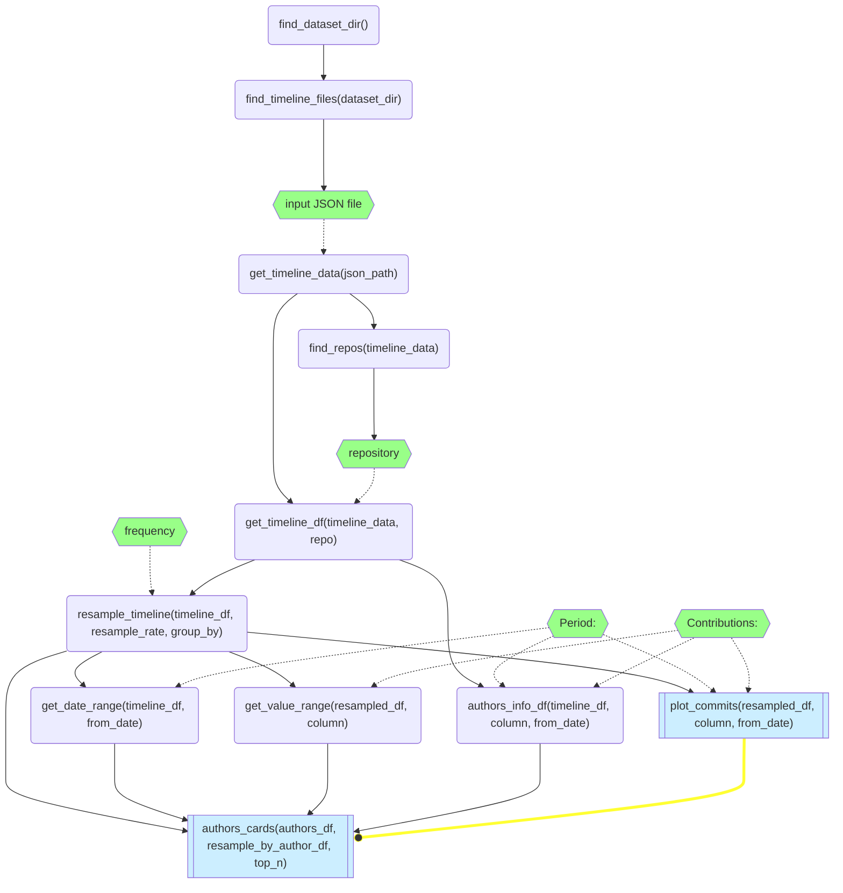

# DiffInsights - web interface for analyzing DiffAnnotator results

This directory includes various web dashboards
that demonstrate how one can use the **`diffanotator`** project.

All web applications in this directory use
the [HoloViz Panel][Panel] framework.

## Contributors graph

This dashboard is meant to be
enhanced version of the Contributors subpage
in the Insights tab
for the GitHub repository
(example: <https://github.com/qtile/qtile/graphs/contributors>)

Below there is a
simplified graph of dependencies between 
- functions (rounded rectangle),
- widgets (hexagons, in green), and 
- outputs ("subroutine" shape, in blue)
in `02-contributors_graph.py`:

[Panel]: https://panel.holoviz.org/ "Panel: The Powerful Data Exploration & Web App Framework for Python"
